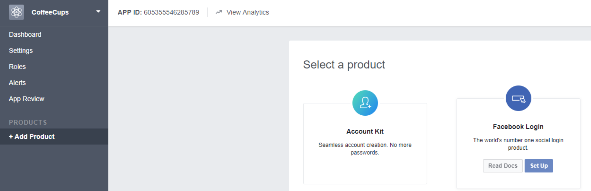
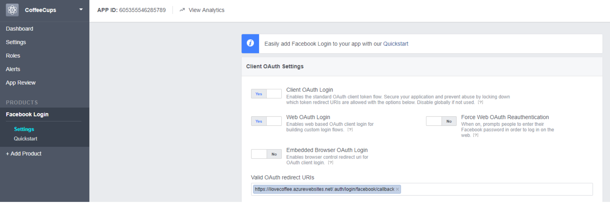

# 5216Homework03
## usyd-mobile-computing-homework03-swift-facebook-login
### Start the third homework ASAP...
- step01:
finish  the tutorial in week 06 and 07;
- step02:
read the requirements carefully and understand about it;
- step03:
Follow the tutorial on website: [Simplified IOS](https://www.simplifiedios.net/facebook-login-swift-3-tutorial/)"NICE WEBSITE...."

## 5216Homework03 requirements
### *Objectives*:
1. Understand how to use Azure Cloud service for user management 2. Understand login using social account
### *Tasks*:
1. Signing up for Facebook Auth
2. Use Azure Mobile Apps SDK for IOS
### Homework3 due date:
1. Develop a basic Running Diary app
2. Worth 10 marks
3. Due in the lab of Week 11

- After storing data in the cloud, every user of the app will see the same content. Therefore, we must also support user login and impose data access permission to each user so different users only see and modify their own data. As login with social account is very common nowadays, in this tutorial we take login with Facebook account as an example. Login with other type of user account such as Google and Twitter are similar with this tutorial.
### *Task 1: Signing up for Facebook Auth*
- Authentication is critical to applications success. Look at your app, and I bet the very first things that your users will do is sign up or log in to their account. This will probably, in turn, leverage some form of social authentication. Each social authentication provider is a little bit different, and some, such as Facebook, offer a native SDK to simplify the login process and offer additional functionality specific to their service. Previously, we looked at how to integrate the Facebook SDK for iOS to offer a native login experience and how to integrate with Azure Mobile Apps, part of Azure App Service.
### You may skip this task if you do not have Facebook account.
1. Before we even begin to integrate Facebook authentication into our app, we must register a new application on the Facebook Developer site. 
2. Next, we’ll want to add a proper _oAuth_ redirect, which can be done by adding a “Facebook Login” product:  
- For this application, we’ll be using Azure App Service, which means we can specify a redirect URL such as:[Azure App Service](https://[AppServiceApplicationURL]/.auth/login/facebook/callback) 
3. You can learn more about configuring this by reading through the Azure App Service Authentication with Facebook documentation.
### Task 2: Use Azure Mobile Apps SDK for IOS
- This guide shows you how to use the Android client SDK for Mobile Apps to implement common scenarios, such as:
- Querying for data (inserting, updating, and deleting).
- Authentication.
- Handling errors.
- Customizing the client.
- This guide focuses on the client-side Android SDK. To learn more about the server-side SDKs for Mobile Apps, see Work with .NET backend SDK or How to use the Node.js backend SDK.
- 
- 
- Please follow the link below to finish this task:
- 

